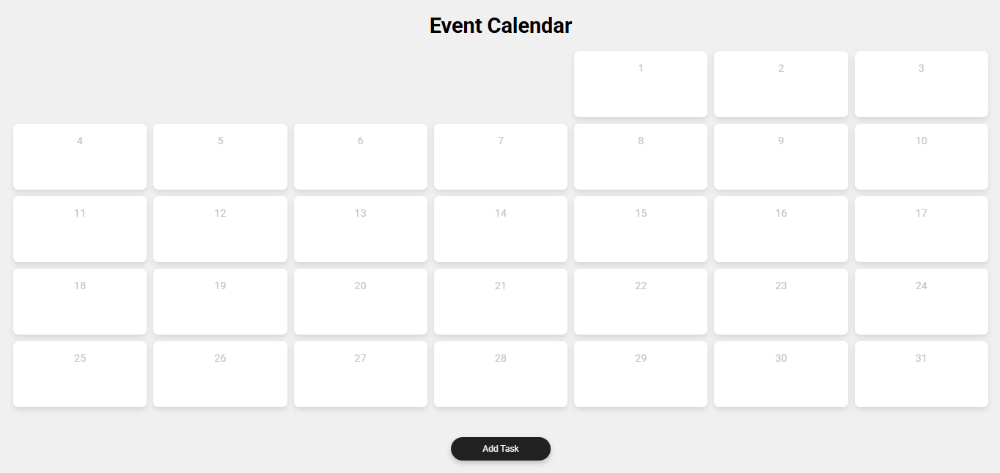

# Calendar Events
Este projeto é um calendário de eventos interativo que permite visualizar, adicionar e gerenciar compromissos ou atividades em datas específicas. É uma aplicação simples e intuitiva, ideal para organizar eventos pessoais, acadêmicos ou profissionais.

# Screenshot
Aqui temos a captura de tela do projeto:

Créditos: [@AsmrProg](https://github.com/AsmrProg-YT)
